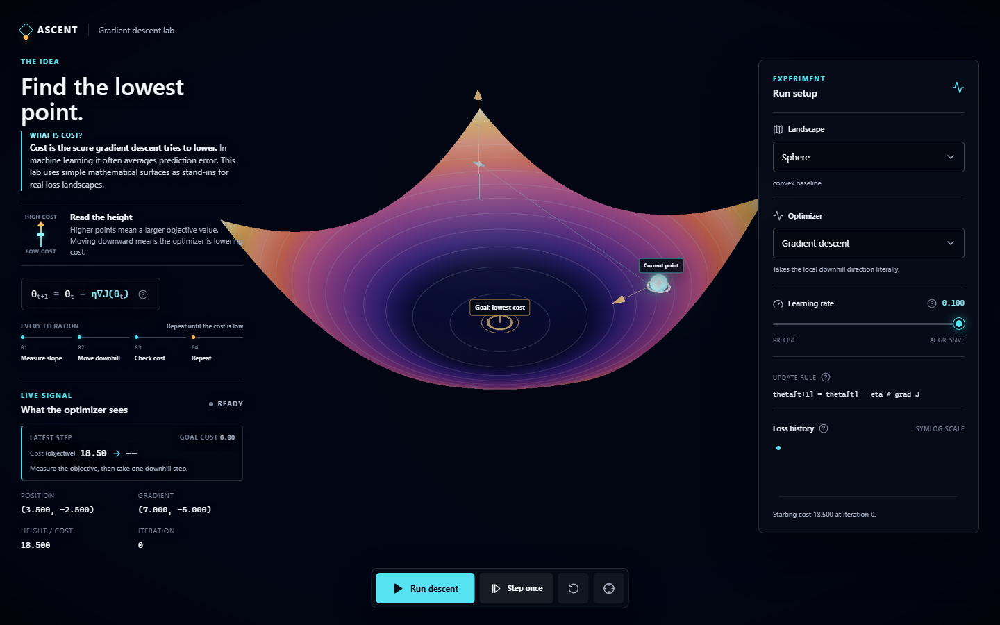

# ASCENT

**Gradient descent, made visible.**

ASCENT is an interactive 3D lab for exploring how optimization algorithms move
through cost landscapes. Pick an objective function, choose an optimizer, adjust
the learning rate, and watch each update happen on the surface.

The first public Vercel deployment is in progress. A live demo link will be added
after the production release.



## Why ASCENT

Gradient descent is often introduced as an update rule:

```text
theta[t+1] = theta[t] - eta * grad J(theta[t])
```

The formula is compact, but it hides the behavior that makes optimization
interesting. A learning rate can be too cautious or too aggressive. Momentum can
carry an optimizer through a shallow region. A curved valley can produce a long
zig-zag path. A saddle point can look settled even though it is not a minimum.

ASCENT turns those ideas into an experiment you can inspect. Height represents
cost, the moving point represents the current parameters, and the path records
completed updates. The interface keeps the numerical state visible alongside the
scene: position, gradient, cost, iteration, target cost, and loss history all
update as the optimizer moves.

## What You Can Explore

ASCENT includes nine objective functions:

| Landscape | What it demonstrates |
| --- | --- |
| Sphere | A simple convex baseline |
| Matyas | Mild conditioning |
| Booth | A clean convex objective with an offset minimum |
| Rosenbrock | A narrow, curved valley and zig-zagging updates |
| Beale | Sharp ill-conditioning |
| Saddle | A stationary point that is not a minimum |
| Himmelblau | Four minima reached from different starting regions |
| Rastrigin | Many regularly spaced local minima |
| Ackley | Local minima with a nearly flat outer region |

You can compare nine optimization methods:

- Gradient descent
- Momentum
- Nesterov accelerated gradient
- AdaGrad
- RMSProp
- Adam
- AdamW
- Nadam
- Newton's method

Each optimizer exposes its update rule and a short explanation in the interface.
Newton's method uses curvature directly, so its learning-rate control is replaced
by a curvature indicator.

## Using The Lab

1. Choose a landscape.
2. Choose an optimizer.
3. Adjust the learning rate when the selected method supports it.
4. Select **Step once** to inspect one update or **Run descent** to animate the
   full path.
5. Compare the cost before and after each step, then watch the loss chart develop.
6. Restart the run to try another configuration.

Drag the scene to orbit the camera and scroll to zoom. Press `Space` to run or
pause when focus is outside an interactive control. Press `R` to restart.

If WebGL is unavailable or the graphics context fails, ASCENT shows a recoverable
fallback state instead of leaving a blank canvas.

## How It Works

The numerical engine and the visual scene are separate:

- Objective expressions are parsed once with Math.js.
- Forward-mode automatic differentiation uses dual numbers to calculate exact
  first derivatives without finite-difference step-size error.
- Ackley's gradient has a guarded implementation at its origin, where the usual
  expression reaches a `0/0` cusp.
- Newton's method derives a symmetric numerical Hessian from the gradient when an
  analytic Hessian is not supplied.
- React Three Fiber maps the active objective onto a Three.js surface and renders
  the optimizer's point, direction, path, target, and flow cues.
- Zustand keeps infrequent interface state separate from per-frame simulation
  state.
- Runtime performance monitoring moves between low, medium, high, and ultra
  graphics tiers. The scene renders on demand while paused to avoid unnecessary
  GPU work.

## Local Development

### Requirements

- Node.js 22
- npm 11.7.0
- A browser with WebGL support for the 3D scene

Install the locked dependency tree and start Vite:

```sh
npm ci
npm run dev
```

Open <http://localhost:3000>.

No environment variables are required for local development. Sentry remains
disabled when no DSN is configured.

To inspect the production build locally:

```sh
npm run build
npm run preview
```

## Validation

The repository uses Vitest for unit and component tests, Playwright for browser
coverage, axe-core for automated accessibility checks, and dedicated scripts for
deployment and performance contracts.

```sh
npm run typecheck
npm test
npm run test:ops
npm run coverage
npm run build
npm run check:bundle
npm run test:e2e
npm run test:performance
```

Install the browser engines before running the Playwright suites for the first
time:

```sh
npx playwright install chromium webkit
```

CI checks:

- TypeScript and unit tests
- Production dependency audit
- Coverage thresholds
- Production build and compressed bundle budgets
- Chromium and WebKit interaction tests
- Serious and critical automated accessibility violations
- Layout behavior across phone, tablet, and landscape viewports
- Mobile slow-4G readiness, with controls enabled within 4 seconds and the WebGL
  canvas visible within 9 seconds

## Project Structure

```text
src/
  engine/       Objective functions, autodiff, optimizers, and stepping
  quality/      Device detection and adaptive graphics tiers
  scene/        Three.js scene, surface, path, lighting, and visual cues
  state/        UI and simulation state
  ui/           Controls, explanations, metrics, and loss history
e2e/            Browser, accessibility, layout, and performance tests
scripts/        Bundle and deployment verification
docs/           Production operations and third-party asset records
```

## Deployment And Monitoring

ASCENT builds to a static `dist` directory. [`vercel.json`](vercel.json) defines
the Vercel build, caching rules, content security policy, and browser security
headers.

Browser error reporting is optional:

| Variable | Purpose |
| --- | --- |
| `VITE_SENTRY_DSN` | Routes browser errors to the Sentry project |
| `VITE_DEPLOY_ENV` | Labels the deployment environment |
| `SENTRY_ORG` | Selects the Sentry organization during the build |
| `SENTRY_PROJECT` | Selects the Sentry project during the build |
| `SENTRY_AUTH_TOKEN` | Uploads private source maps during the build |

Never prefix the auth token with `VITE_`. Vite exposes every `VITE_*` value to
browser JavaScript.

When Sentry is configured, ASCENT removes user data, breadcrumbs, extra context,
query strings, and URL fragments before sending an event. The build uploads
hidden source maps, then deletes them from `dist` before deployment.

See [`.env.example`](.env.example) for the configuration template and
[`docs/production-runbook.md`](docs/production-runbook.md) for release,
verification, monitoring, and rollback procedures.

## Contributing

Keep changes focused and include tests for behavior that changes. Before opening a
pull request, run the validation commands relevant to your work. For changes to
the simulation engine, add or update unit tests. For visible workflows, include
Playwright coverage when practical.

For larger changes, open a GitHub issue first so the behavior and scope can be
discussed before implementation.

## Assets And License

ASCENT's source code is available under the [MIT License](LICENSE).
Third-party asset provenance and licensing are recorded in
[`docs/asset-licenses.md`](docs/asset-licenses.md).
